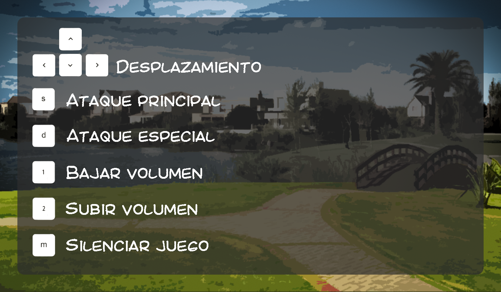

# Nightmare in Nordelta

## Equipo de desarrollo

- Fernández Francou, Tomás
- Fernández, Facundo Agustín
- Espósito, Lucas
- Hernández Abbaticchio, Thiago Daniel
- Cicerchia, Francisco

## Capturas

<!--  -->

## Reglas de Juego / Instrucciones

<strong>Nightmare in Nordelta</strong> es un atrapante y divertido juego donde debes ayudar a Capy, representante de la comunidad carpincha, a marcarle su territorio a los caniches del barrio. Para ello, Capy puede ejecutar tanto su ataque principal como su ataque especial, ¡Pero ojo! No puedes usar siempre el ataque especial, así que vas a tener que usarlo sabiamente.

## Respuestas teóricas

Ver Documento Teorico : https://docs.google.com/document/d/1uVla9GCsNuiZd92VdnsoZGyMF-W-HrnO8o_mFCnVCk0/edit
