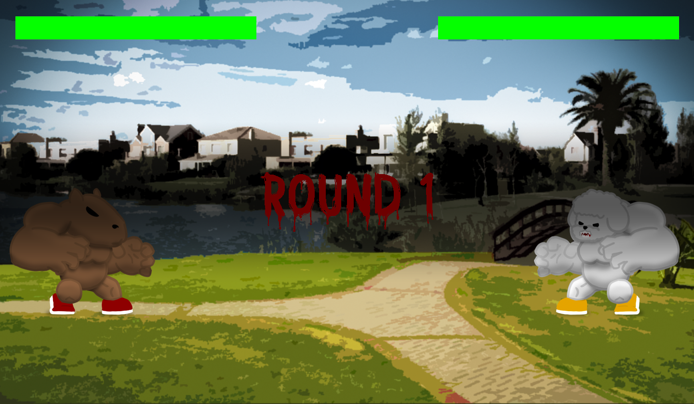

# Nightmare in Nordelta

## Equipo de desarrollo

- Fernández Francou, Tomás
- Fernández, Facundo Agustín
- Espósito, Lucas
- Hernández Abbaticchio, Thiago Daniel
- Cicerchia, Francisco

## Capturas

## Reglas de Juego / Instrucciones

&emsp;⬆️&emsp;&nbsp;&nbsp;&nbsp;Salto 
⬅️&nbsp;&nbsp;&nbsp;➡️&emsp;Desplazamiento hacia los lados

## Respuestas teóricas

> Cuando creamos los enemigos en los distintos niveles (hasta ahora solo nivel 1), le decimos a la factory "createEnemy()", y delegamos en ella la creación de los enemigos.  
Otro momento en el que observamos el uso del polimorfismo es cuando llamamos al método "executeAttack" de los distintos ataques. A este mensaje, le pasamos la entidad que queremos atacar, y depende de la entidad como resuelve los ataques que recibe.
